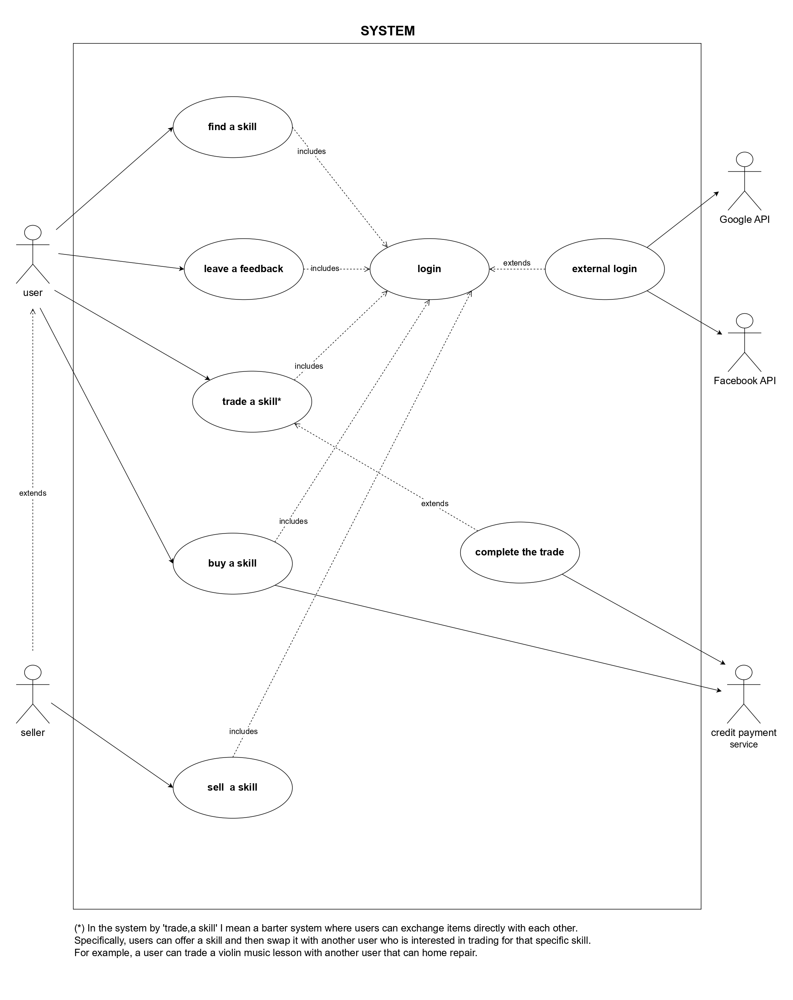

# Use Case
describes how a user interacts with a system to achieve a specific goal. It is a valuable tool in software development, as it helps define system requirements from the user's perspective.
### Use Case Diagram
is a visual representation of how users (or "actors") interact with a system to achieve specific goals. It helps to illustrate the functionality of the system and the relationships between users and the system's features.

### Internal Steps
#### Name : Trade a skill
1. The user1* propose a skill trade;
2. The system notifies the user2* saying that an exchange proposal has come to them;
3. The user2 evaluates the skill trade;
4. The system notifies the user1 about the decision of user2;
5. The system connects the two users through an internal chat;
6. Both the users after 
7. 
8.
#### Extensions:
- (3a) The user2 *decline the trade*: System  
 

